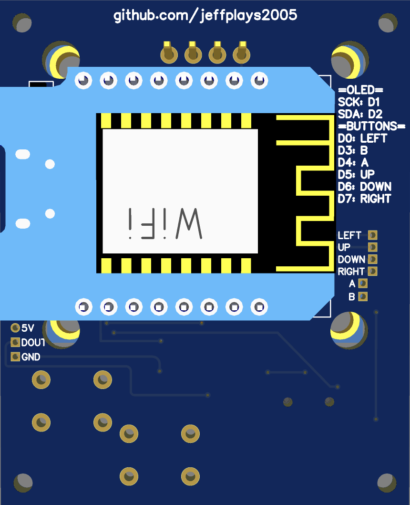

## Hackheld

A open source hackable handheld for DIY.

## Hackheld Altair

 

> [!NOTE]
> This project is still in development and is not yet finished. Please check back later for updates.

**NOTE:** There is no 3d print case designed for this project yet. If you'd like to contribute, please feel free to!

This is a redesign of [SpaceHuhn's Hackheld Vega](https://github.com/SpacehuhnTech/Hackheld) but with a 5 direction switch and a smaller board.

It can run the [ESP8266 Deauther](https://github.com/spacehuhntech/esp8266_deauther), but you can also write your own firmware using Arduino.

### DIY this project

Check out the releases tab!

I highly recommend buying the exact same parts as the section down below as many manufacturers use different 5 directional switches and I've designed the routes according to the one thats listed.

You can use any PCB manufacturing!

Please star this repository if you appreciated my work and would like to help me out!! Thanks in advance.

To flash the esp8266 board, please visit https://github.com/SpacehuhnTech/Hackheld

### Parts

Everything is purchased from Aliexpress and have been carefully selected so they are the cheapest avaliable options for most people:

1.3" display(can alternate but ensure the pins are **VDD,GND,SCK,SDA**): https://www.aliexpress.com/item/4001145494936.html

D1 mini(can alternate but ensure that you are getting one with the correct dimensions): https://www.aliexpress.com/item/32816149164.html

WS2812B 5050 RGB LED: https://www.aliexpress.com/item/1005002653014067.html

6*6 buttons(4 pin): https://www.aliexpress.com/item/33046122537.html

5 direction button(not suitable for alternatives): https://www.aliexpress.com/item/33024133078.html

Simple soldering and wire cutters may be needed to solder on + make sure the parts fit(the pins might be too long).

### Credits
Original Hackheld by SpaceHuhn: https://github.com/SpacehuhnTech/Hackheld *Inspiration + original creator(of the firmware too)! Thx Stefan.*

DSTike hackheld schematics: https://github.com/lspoplove/Deauther-Project *Used schematics to view more detailed wiring*

ItsKarilito: https://github.com/ItsKarlito/Hackheld *Redesigned the PCB and fixed some errors on the original Hackheld*

### License

This is open source, just like the original hackheld!
